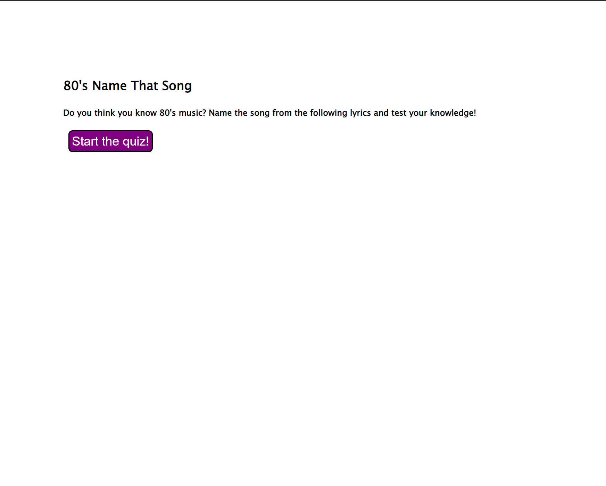

# 80s Music Quiz App

## Description

This quiz application is a marriage of HTML, CSS, and Javascript to create a timed quiz that keeps score, changes the question as they are answered, and allows the user to add their initials and save their score. The questions are a name-that-tune using a lyric from a song from the 80s, from which the user needs to match the song and artist provided in the choices. 

https://jennnmarshall.hithub.io/quiz-app

## Installation

N/A

## Usage

This application is designed to progress with button clicks. To start the quiz, the user should click the start button. To progress through the questions, the user should click an answer. To record a score, the user should enter their initials and press the submit button. To begin again or clear the score, the user should select the appropriate button on the last page. 

## Credits

Jenn Marshall, 2022.

## License

Please refer to the license in the repo.

